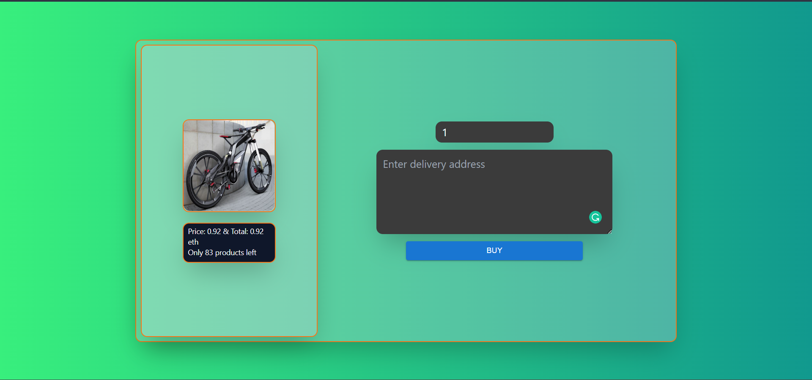
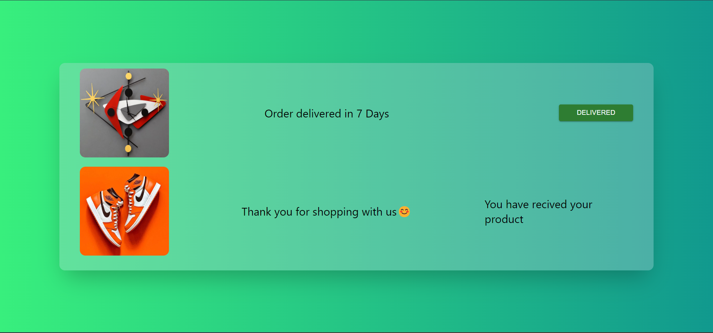

<!-- About this project -->

# **🚀Web3.0 E-commerce Shop 🛒🏪🏬🛍️**
This project is a groundbreaking e-commerce shop fully integrated with blockchain technology, specifically built on the Ethereum Blockchain. It allows users to register products for sale and purchase listed products from the store, ensuring transaction completion through purchase confirmations.

  

## Build with🚀
* [Solidity](https://docs.soliditylang.org/)
* [Hardhat](https://hardhat.org/getting-started/)
* [React.js](https://reactjs.org/)
* [Next.js](https://nextjs.org/)
* [Typescript](https://www.typescriptlang.org/)
* [Tailwind](https://tailwindcss.com/)
* [ethers.js](https://docs.ethers.io/v5/)
* [Pinata](https://www.pinata.cloud/)

<!-- User manual -->

# User Manual

## Marketplace

### **Entry Page **

 This is the initial page of the Dapp, where users can choose to either conduct business by listing products or go shopping.

 

  
 

### **Marketplace Page 🛒**

This is the central hub of the Dapp where all products are listed. Users can view both their products and others' products, and make purchases by clicking on the items they need.

### **Product Description Page 🧾**

Clicking on a product in the marketplace takes users to its description page.  

 

  
 

 Here, they can see detailed information about the product and make a purchase by clicking the **Buy** button. If the user is the product owner, it indicates ownership status.

 ### **Buy Page 💸💰💳**

 To purchase a product, users navigate from the description page by clicking the **Buy** button. 

 

  
 

 On the buy page, they specify the quantity and delivery address. The total cost is displayed below the product image, and the user can complete the purchase by clicking the **Buy** button.

 ### **Items Collection Page 🛍️**

 This page displays all products owned by the user. Users can access this page by clicking the **My Products** option in the marketplace's navigation bar.

 

  
 

 After receiving a product, users can click the **Delivered** button to confirm ownership.

 ## Business

 

 

 ### **List Product Page 📜**

 

  
 

 You need to upload a product image, provide a title and description, specify the stock quantity, set the price, and click the **List Product** button to add the product to the marketplace.

 ### **Listed Product Page 🛒**

 By clicking the **My Products** button in the navigation bar, users are taken to the Listed Product page. Here, they can view all their listed products. Clicking on a product shows an image and a **My Customers** button. If there are no customers, nothing is displayed. If customers exist, their Metamask addresses are shown along with a **SHOW ME ADDRESS** button. Clicking this button reveals a pop-up window with the customer's delivery address.

 

  
 

